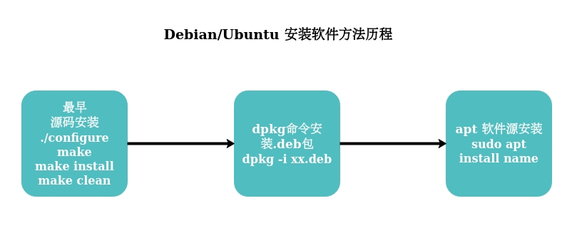

# APT 原理剖析、详解

> APT - Advanced Packaging Tool

 软件安装方法历程图

## apt 基本命令

每当执行命令进行软件的安装或着更新，或者软件源的更新时，apt会访问/etc/apt/sources.list内的地址，并在该网站中找到对应系统的包信息例如我的操作系统是ubuntu，网站是deb http://mirrors.163.com/ubuntu/ precise main restricted universe multiverse网易的，那么当我们执行安装的命令时，他就会对应的访问http://mirrors.163.com/ubuntu/dists/lucid/main/binary-i386/的packages.gz，这个文件是服务器上软件包及其依赖关系的清单，并且用gzip压缩过了。apt-get update使用这个清单来确定能够获得哪些补充的软件包且他的内容会被保存在/var/lib/apt/lists内，通过访问这个lists确定该软件是否已安装，是否是最新版本，依赖关系是否满足，从而确定要更新内容，并进行更新，其安装过程主要是由dpkg来完成
