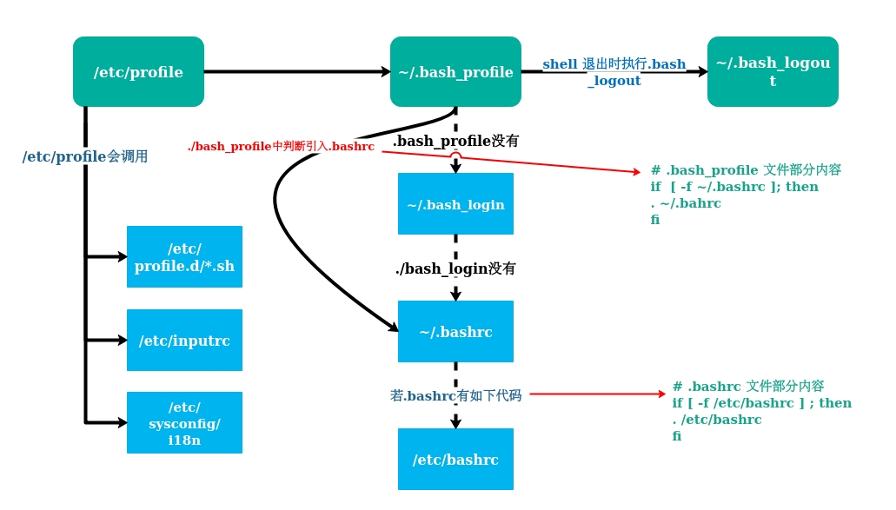

# Linux 环境变量相关文件详解

<div align=center>
<br>login shell载入读取环境配置文件过程图
</div>

### /etc/profile 文件
``` shell
# /etc/profile: system-wide .profile file for the Bourne shell (sh(1))
# and Bourne compatible shells (bash(1), ksh(1), ash(1), ...).

if [ "${PS1-}" ]; then
  if [ "${BASH-}" ] && [ "$BASH" != "/bin/sh" ]; then
    # The file bash.bashrc already sets the default PS1.
    # PS1='\h:\w\$ '
    if [ -f /etc/bash.bashrc ]; then
      . /etc/bash.bashrc
    fi
  else
    if [ "`id -u`" -eq 0 ]; then
      PS1='# '
    else
      PS1='$ '
    fi
  fi
fi

if [ -d /etc/profile.d ]; then
  for i in /etc/profile.d/*.sh; do
    if [ -r $i ]; then
      . $i
    fi
  done
  unset i
fi

#set Java enviroment
JAVA_HOME=/opt/Java
JRE_HOME=$JAVA_HOME/
CLASSPATH=.:JAVA_HOME/lib/:$JAVA_HOME/lib/:$JRE_HOME/lib
PATH=$PATH:$JAVA_HOME/bin:$JRE_HOME/bin
export JAVA_HOME JRE_HOME PATH CLASSPATH
https_proxy=127.0.0.1:1080
http_proxy=127.0.0.1:1080
export http_proxy https_proxy
```

### /etc/bash.bashrc

``` shell
# System-wide .bashrc file for interactive bash(1) shells.
# To enable the settings / commands in this file for login shells as well,
# this file has to be sourced in /etc/profile.

# If not running interactively, don't do anything
[ -z "$PS1" ] && return

# check the window size after each command and, if necessary,
# update the values of LINES and COLUMNS.
shopt -s checkwinsize

# set variable identifying the chroot you work in (used in the prompt below)
if [ -z "${debian_chroot:-}" ] && [ -r /etc/debian_chroot ]; then
    debian_chroot=$(cat /etc/debian_chroot)
fi

# set a fancy prompt (non-color, overwrite the one in /etc/profile)
# but only if not SUDOing and have SUDO_PS1 set; then assume smart user.
if ! [ -n "${SUDO_USER}" -a -n "${SUDO_PS1}" ]; then
  PS1='${debian_chroot:+($debian_chroot)}\u@\h:\w\$ '
fi

# Commented out, don't overwrite xterm -T "title" -n "icontitle" by default.
# If this is an xterm set the title to user@host:dir
#case "$TERM" in
#xterm*|rxvt*)
#    PROMPT_COMMAND='echo -ne "\033]0;${USER}@${HOSTNAME}: ${PWD}\007"'
#    ;;
#*)
#    ;;
#esac

# enable bash completion in interactive shells
#if ! shopt -oq posix; then
#  if [ -f /usr/share/bash-completion/bash_completion ]; then
#    . /usr/share/bash-completion/bash_completion
#  elif [ -f /etc/bash_completion ]; then
#    . /etc/bash_completion
#  fi
#fi

# sudo hint
if [ ! -e "$HOME/.sudo_as_admin_successful" ] && [ ! -e "$HOME/.hushlogin" ] ; then
    case " $(groups) " in *\ admin\ *|*\ sudo\ *)
    if [ -x /usr/bin/sudo ]; then
	cat <<-EOF
	To run a command as administrator (user "root"), use "sudo <command>".
	See "man sudo_root" for details.
	
	EOF
    fi
    esac
fi

# if the command-not-found package is installed, use it
if [ -x /usr/lib/command-not-found -o -x /usr/share/command-not-found/command-not-found ]; then
	function command_not_found_handle {
	        # check because c-n-f could've been removed in the meantime
                if [ -x /usr/lib/command-not-found ]; then
		   /usr/lib/command-not-found -- "$1"
                   return $?
                elif [ -x /usr/share/command-not-found/command-not-found ]; then
		   /usr/share/command-not-found/command-not-found -- "$1"
                   return $?
		else
		   printf "%s: command not found\n" "$1" >&2
		   return 127
		fi
	}
fi
```

### /etc/environment

``` shell
PATH="/usr/local/sbin:/usr/local/bin:/usr/sbin:/usr/bin:/sbin:/bin:/usr/games:/usr/local/games:$JAVA_HOME/bin"
export CLASSPATH=.:$JAVA_HOME/lib
export JAVA_HOME=/opt/Java
```

### ~/.bashrc

``` shell
# ~/.bashrc: executed by bash(1) for non-login shells.
# see /usr/share/doc/bash/examples/startup-files (in the package bash-doc)
# for examples

# If not running interactively, don't do anything
case $- in
    *i*) ;;
      *) return;;
esac

# don't put duplicate lines or lines starting with space in the history.
# See bash(1) for more options
HISTCONTROL=ignoreboth

# append to the history file, don't overwrite it
shopt -s histappend

# for setting history length see HISTSIZE and HISTFILESIZE in bash(1)
HISTSIZE=1000
HISTFILESIZE=2000

# check the window size after each command and, if necessary,
# update the values of LINES and COLUMNS.
shopt -s checkwinsize

# If set, the pattern "**" used in a pathname expansion context will
# match all files and zero or more directories and subdirectories.
#shopt -s globstar

# make less more friendly for non-text input files, see lesspipe(1)
[ -x /usr/bin/lesspipe ] && eval "$(SHELL=/bin/sh lesspipe)"

# set variable identifying the chroot you work in (used in the prompt below)
if [ -z "${debian_chroot:-}" ] && [ -r /etc/debian_chroot ]; then
    debian_chroot=$(cat /etc/debian_chroot)
fi

# set a fancy prompt (non-color, unless we know we "want" color)
case "$TERM" in
    xterm-color|*-256color) color_prompt=yes;;
esac

# uncomment for a colored prompt, if the terminal has the capability; turned
# off by default to not distract the user: the focus in a terminal window
# should be on the output of commands, not on the prompt
#force_color_prompt=yes

if [ -n "$force_color_prompt" ]; then
    if [ -x /usr/bin/tput ] && tput setaf 1 >&/dev/null; then
	# We have color support; assume it's compliant with Ecma-48
	# (ISO/IEC-6429). (Lack of such support is extremely rare, and such
	# a case would tend to support setf rather than setaf.)
	color_prompt=yes
    else
	color_prompt=
    fi
fi

if [ "$color_prompt" = yes ]; then
    PS1='${debian_chroot:+($debian_chroot)}\[\033[01;32m\]\u@\h\[\033[00m\]:\[\033[01;34m\]\w\[\033[00m\]\$ '
else
    PS1='${debian_chroot:+($debian_chroot)}\u@\h:\w\$ '
fi
unset color_prompt force_color_prompt

# If this is an xterm set the title to user@host:dir
case "$TERM" in
xterm*|rxvt*)
    PS1="\[\e]0;${debian_chroot:+($debian_chroot)}\u@\h: \w\a\]$PS1"
    ;;
*)
    ;;
esac

# enable color support of ls and also add handy aliases
if [ -x /usr/bin/dircolors ]; then
    test -r ~/.dircolors && eval "$(dircolors -b ~/.dircolors)" || eval "$(dircolors -b)"
    alias ls='ls --color=auto'
    #alias dir='dir --color=auto'
    #alias vdir='vdir --color=auto'

    alias grep='grep --color=auto'
    alias fgrep='fgrep --color=auto'
    alias egrep='egrep --color=auto'
fi

# colored GCC warnings and errors
#export GCC_COLORS='error=01;31:warning=01;35:note=01;36:caret=01;32:locus=01:quote=01'

# some more ls aliases
alias ll='ls -alF'
alias la='ls -A'
alias l='ls -CF'

# Add an "alert" alias for long running commands.  Use like so:
#   sleep 10; alert
alias alert='notify-send --urgency=low -i "$([ $? = 0 ] && echo terminal || echo error)" "$(history|tail -n1|sed -e '\''s/^\s*[0-9]\+\s*//;s/[;&|]\s*alert$//'\'')"'

# Alias definitions.
# You may want to put all your additions into a separate file like
# ~/.bash_aliases, instead of adding them here directly.
# See /usr/share/doc/bash-doc/examples in the bash-doc package.

if [ -f ~/.bash_aliases ]; then
    . ~/.bash_aliases
fi

# enable programmable completion features (you don't need to enable
# this, if it's already enabled in /etc/bash.bashrc and /etc/profile
# sources /etc/bash.bashrc).
if ! shopt -oq posix; then
  if [ -f /usr/share/bash-completion/bash_completion ]; then
    . /usr/share/bash-completion/bash_completion
  elif [ -f /etc/bash_completion ]; then
    . /etc/bash_completion
  fi
fi

#set rm='rm -i'
alias rm='rm -i'

#set mv='mv -i'
alias mv='mv -i'

#export http_proxy='127.0.0.1:1080'
#export https_proxy='127.0.0.1:1080'
export ftp_proxy=''
export socks_proxy=''
export PATH="$PATH:/opt/mssql-tools/bin"
```
